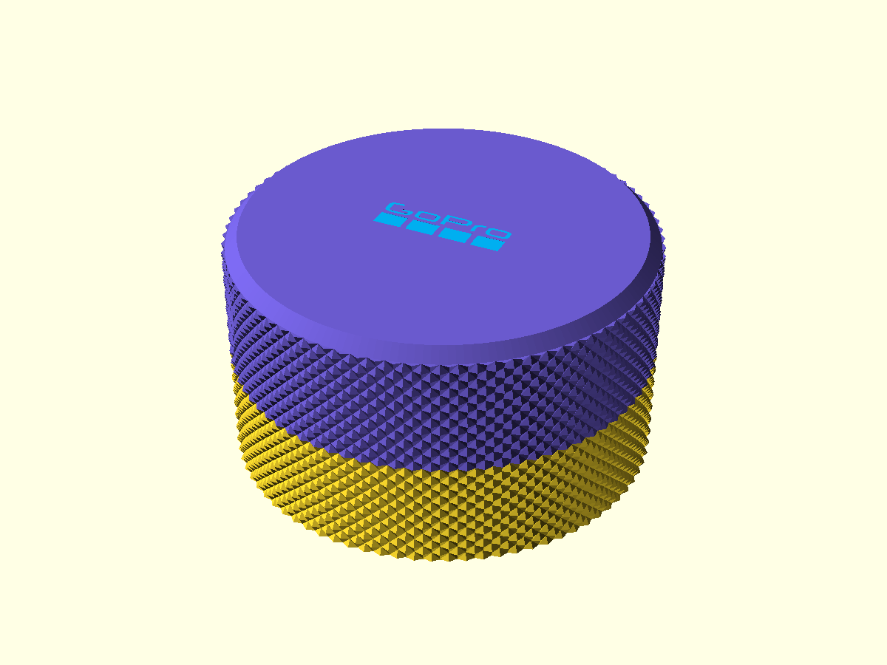
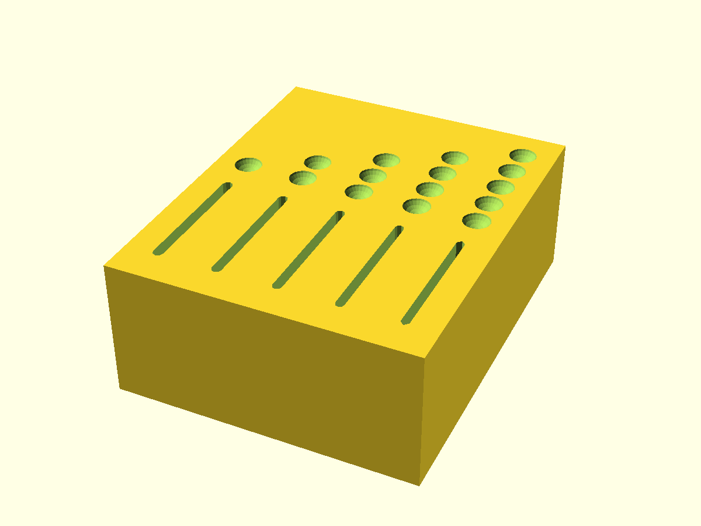
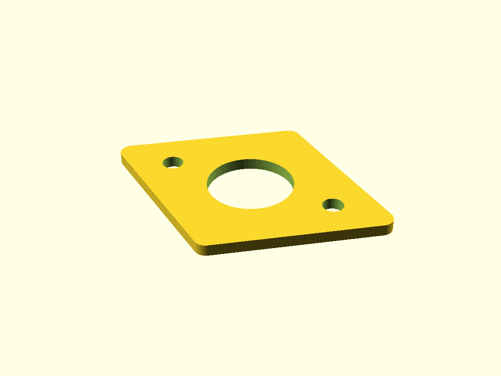
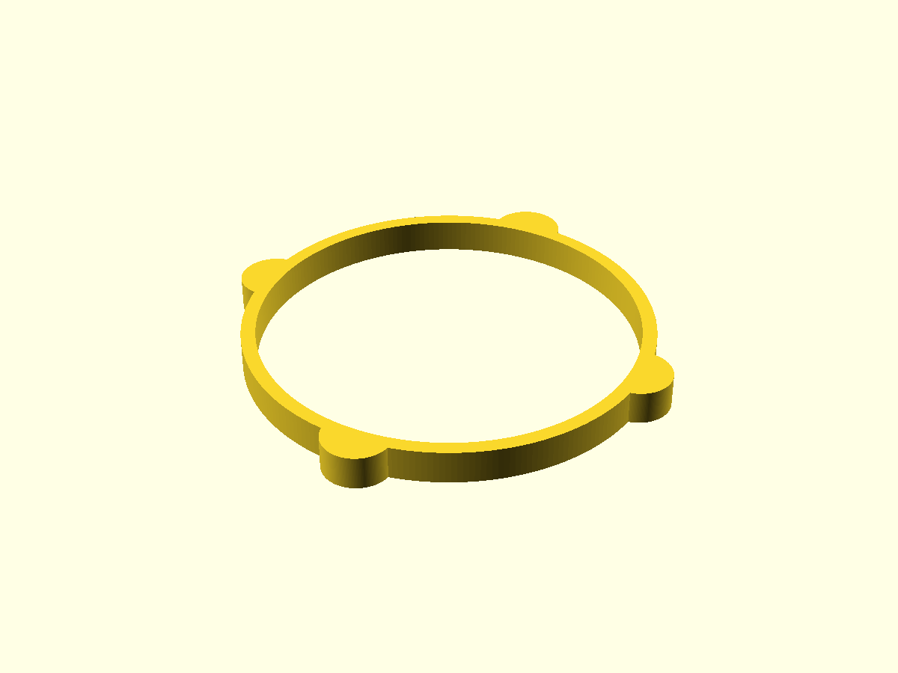
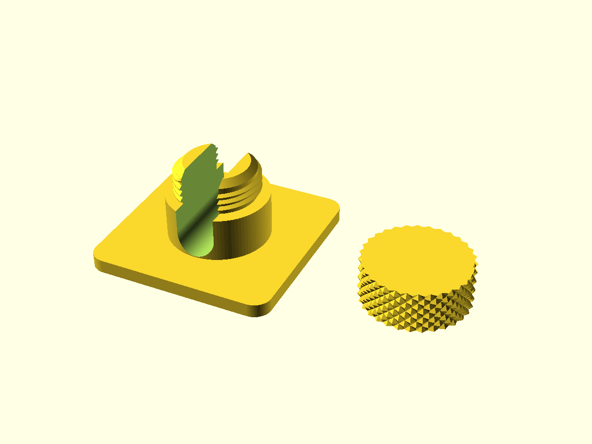

# 3D-Models

A catalog of my 3D-printable designs. Each entry below is auto-generated from
the source `.scad` files.

# Designs

<!-- designs:start -->

## gopro-battery-case

**Source:** [gopro-battery-case.scad](gopro-battery-case/gopro-battery-case.scad)
**3MF:** [base](gopro-battery-case/3mf/gopro-battery-case-base.3mf) · [lid](gopro-battery-case/3mf/gopro-battery-case-lid.3mf)

**Source:** [sd-slot-test.scad](gopro-battery-case/sd-slot-test.scad)
**3MF:** [sd-slot-test](gopro-battery-case/3mf/sd-slot-test.3mf)

## superwinch-adapter-plate

**Source:** [superwinch-adapter-plate.scad](superwinch-adapter-plate/superwinch-adapter-plate.scad)
**3MF:** [superwinch-adapter-plate](superwinch-adapter-plate/3mf/superwinch-adapter-plate.3mf)

## water-cartridge-spacer

**Source:** [water-cartridge-spacer.scad](water-cartridge-spacer/water-cartridge-spacer.scad)
**3MF:** [solid](water-cartridge-spacer/3mf/water-cartridge-spacer-solid.3mf) · [ventilated](water-cartridge-spacer/3mf/water-cartridge-spacer-ventilated.3mf)

## wire-mounts

**Source:** [wire_mount.scad](wire-mounts/wire_mount.scad)
**3MF:** [holder](wire-mounts/3mf/wire_mount-holder.3mf) · [cap](wire-mounts/3mf/wire_mount-cap.3mf)

<!-- designs:end -->
